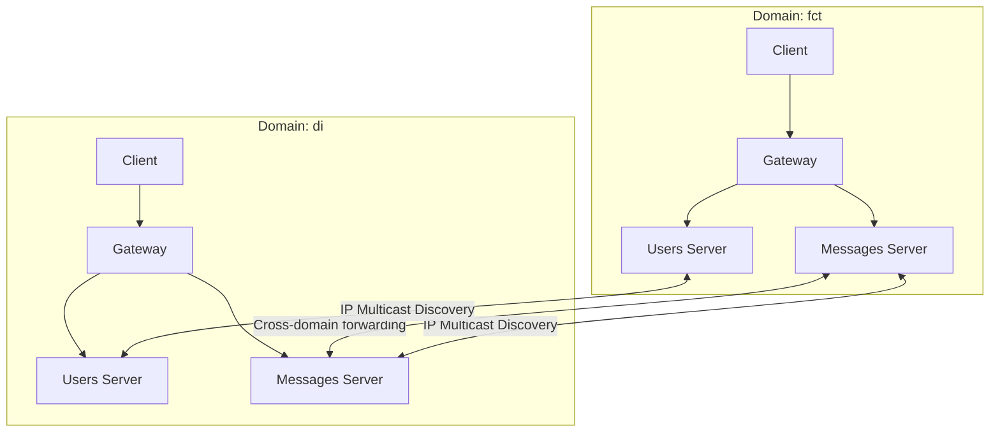

A distributed message delivery system modelling core email infrastructure across isolated network domains. The system handles cross-domain message routing, dynamic service discovery via IP multicast, TLS-secured channels, and fault-tolerant message storage through server replication — implemented in Java against a pre-defined service contract.

## Core Capabilities

**Domain Architecture:** Each domain runs independent User and Message servers; users always contact their own domain, which routes outbound messages to recipient domains automatically. An optional Gateway server acts as a unified REST proxy, forwarding requests to the appropriate domain service.

**Service Discovery:** Servers broadcast their presence via UDP IP multicast, announcing service name, domain, and URI on a shared multicast group. Clients and servers discover each other dynamically at runtime — no hard-coded addresses required.

**Cross-Domain Messaging:** The Messages service forwards outbound messages to recipient servers in foreign domains. Delivery failures generate structured notification messages placed in the sender's mailbox — `FAILED TO SEND mid TO user: UNKNOWN USER` or `TIMEOUT` after a configurable deadline.

**Security:** Client–server interactions use TLS with X.509 certificate authentication. Server-to-server communication is secured via a shared secret, preventing clients from invoking server-only operations on the Messages and Users services.

**Fault Tolerance:** Messages servers support replication through two strategies — a primary/secondary protocol ensuring reads survive primary failure, and a Kafka-based state machine replication alternative. Versioned response headers (`X-MESSAGES-*`) guarantee clients always read state at least as recent as a previously accessed version.

**External Mailbox Integration:** An alternative Messages server stores mailboxes in Zoho Mail via REST with OAuth 2.0, using ScribeJava for authentication and embedding message metadata in email bodies using a structured separator.

## Technology Stack

**Language & Services:** Java with JAX-RS (Jersey) for REST endpoints; gRPC as an optional transport layer for interoperable cross-domain communication.

**Persistence:** Hibernate ORM backed by a relational database for local user and mailbox storage.

**Containerization:** Docker, with instances named `server.domain` for automatic domain resolution at runtime.

**Service Discovery:** Java UDP multicast sockets for periodic service announcements across all nodes.

**Security:** TLS via JSSE with per-domain X.509 certificates; a shared server secret for inter-server authentication.

**Fault Tolerance:** Apache Kafka for log-based state machine replication; custom primary/secondary protocol as an alternative.

**Build:** Maven multi-module project.

## Architecture

The system is composed of multiple isolated domains. Each domain contains its own User server and Message server, with an optional Gateway as a unified entry point. Servers discover each other dynamically; all cross-domain routing is handled transparently by the sending domain's Message server.



Each domain's Message server discovers foreign servers via multicast and forwards messages directly, without a central broker. The Message server within a domain can be replicated — the primary handles writes while secondaries serve reads, with version headers enforcing read consistency.

## Project Scope

**Remote Invocation & Distribution**
- Functional REST Users, Messages, and Gateway servers with all CRUD operations
- Concurrent request handling across multiple clients
- IP multicast auto-discovery of all domain services
- Full cross-domain message forwarding with failure notifications

**Security**
- TLS channels with X.509 server certificate authentication
- Shared-secret inter-server authentication to isolate server-only operations

**Fault Tolerance**
- Primary/secondary replication of the Messages server with read availability on primary failure
- Kafka-based state machine replication as an alternative strategy

**External Integration**
- Zoho Mail mailbox storage via REST with OAuth 2.0 authentication

## Setup

```bash
git clone https://github.com/lourencosilvabeato/Distributed-Systems.git
cd Distributed-Systems
mvn package -DskipTests
```

Build the Docker image:
```bash
docker build -t sd-server .
```

Launch a domain (example: `fct`):
```bash
# Users server
docker run --hostname users0.fct sd-server users <port> fct

# Messages server
docker run --hostname msgs0.fct sd-server messages <port> fct

# Gateway (optional)
docker run --hostname gw0.fct sd-server gateway <port> fct
```

Servers discover each other automatically via multicast — no manual address configuration needed.

Run integration tests:
```bash
bash test-sd-tp1.sh   # Part 1 test suite
bash test-sd-tp2.sh   # Part 2 test suite
```

## Key Configuration

`multicast.address` — shared IP multicast group for service announcements, `multicast.port` — UDP port for discovery broadcasts, `server.secret` — shared secret for inter-server authentication, `keystore` / `truststore` — TLS identity and trusted CA certificates, `-extralongfault` — timeout threshold in seconds before a failed send generates a TIMEOUT notification.

---

**Distributed systems concepts demonstrated:** service auto-discovery via multicast, remote invocation with REST and gRPC, fault-tolerant state replication (primary/secondary and Kafka), TLS mutual authentication, and cross-domain message routing — all built against a fixed service contract to ensure interoperability with an automated test suite.
